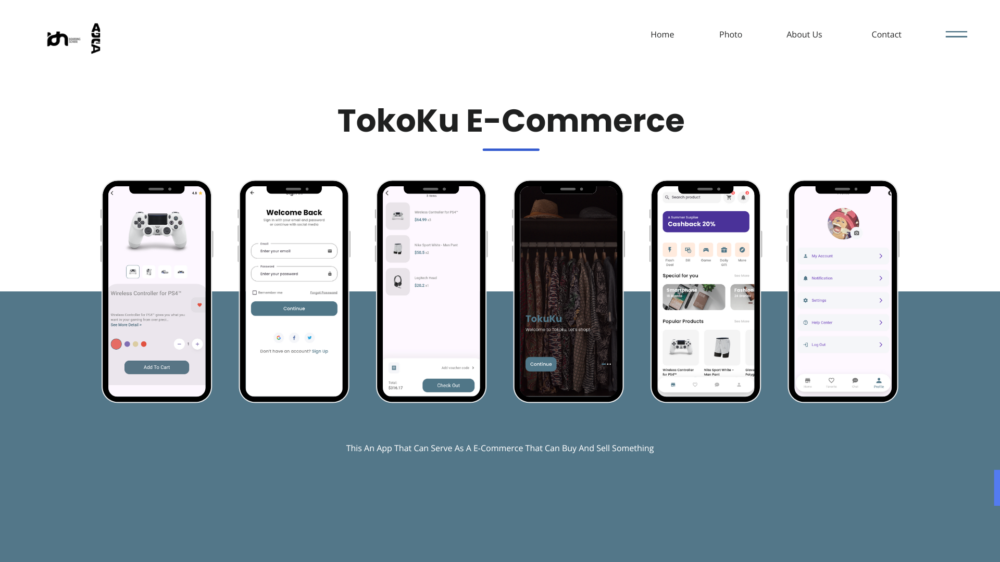
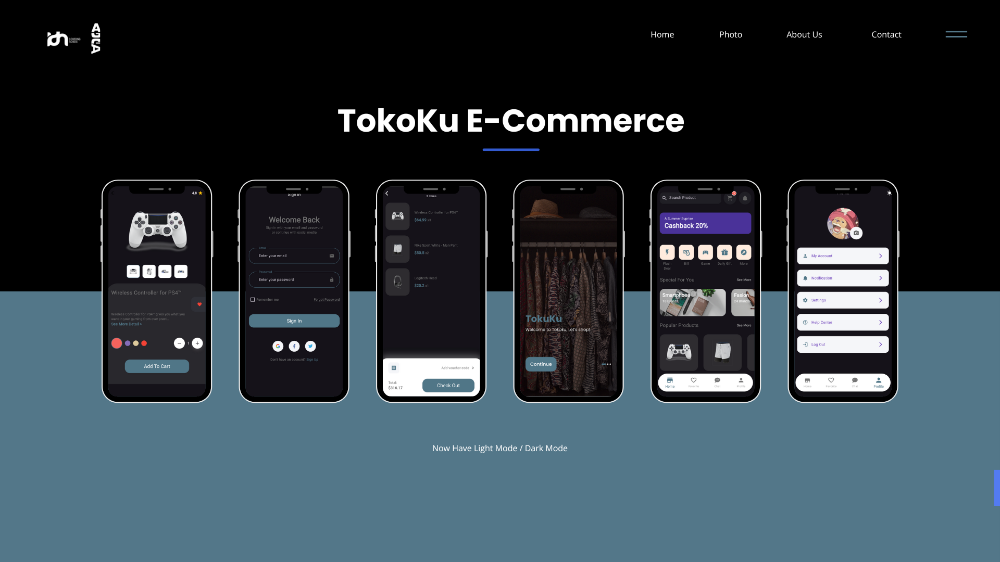

# e_commerce

A new Flutter project.

# E-Commerce Flutter

E-Commerce Flutter adalah aplikasi mobile, web, dan desktop berbasis Flutter untuk platform Android, iOS, Web, dan Desktop, yang dirancang untuk kebutuhan e-commerce.

## Fitur

- **Cross-platform**: Berjalan di Android, iOS, Web, dan Desktop.
- **UI Responsif**: Dioptimalkan untuk berbagai ukuran layar.
- **Kustomisasi Mudah**: Mudah dimodifikasi dan diperluas untuk proyek yang berbeda.
- **Fitur E-Commerce**: Pengelolaan produk, keranjang belanja, autentikasi pengguna, dan lainnya.

## Memulai

### Prasyarat

Pastikan Anda sudah menginstal Flutter di sistem Anda. Jika belum, ikuti [panduan instalasi Flutter](https://flutter.dev/docs/get-started/install) untuk OS Anda.

### Setup

1. Kloning repositori:
   ```bash
   git clone https://github.com/your-username/ecommerce_flutter.git
   cd ecommerce_flutter

2. Install the required dependencies:
   ```
   flutter pub get
   ```

3. Run the project on your desired platform:
   ```
   flutter run
   ```

### Building for Production

- **Android**:
  ```
  flutter build apk
  ```

- **iOS**:
  ```
  flutter build ios
  ```

- **Web**:
  ```
  flutter build web
  ```

- **Windows**:
  ```
  flutter build windows
  ```

## Usage

Here are some screenshots of the application:

- Update configurations in constant.dart if necessary.
- Add your API or backend details.
- Use the provided components and screens to build new features.

## Mockups

Berikut adalah mockup dari aplikasi:

| Tampilan Mockup 1        | Tampilan Mockup 2    |
|--------------------------|----------------------|
|  |  |

## Folder Structure

- **lib/**: Contains the main Dart code.
- **assets/**: Stores static assets like images, fonts, etc.
- **android/**, **ios/**, **web/**, **windows/**: Platform-specific files.
- **pubspec.yaml**: Manages project dependencies.

## Contributing

Feel free to fork the repository and submit pull requests to contribute to the project.

## License

Salin kode ini langsung ke file `README.md` untuk melengkapi dokumentasi proyek Anda. Jangan lupa mengganti placeholder seperti `<repository-url>` dengan informasi spesifik dari proyek Anda! 😊
